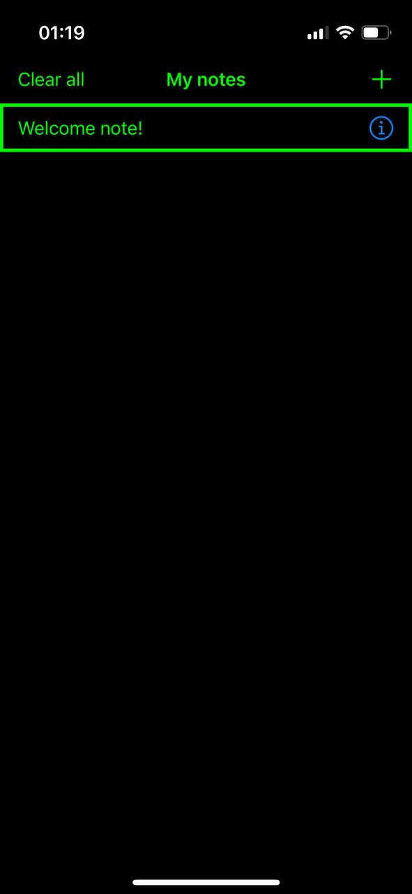
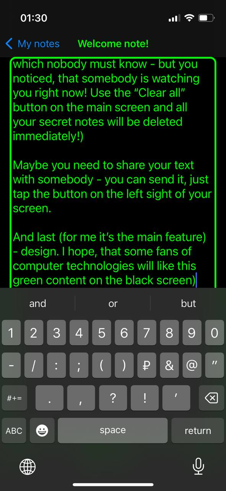

# Own Note App for IOS
### Simple App-Note for IOS (pet project)

  
  
  
  
   
  
  
  
  
   
  
  
  
  
   
  
  
  
  
   
  
  
  
  
   
  

## Overview
This application is an pet project and was created for study some UIKit tools, mostly UITableViewController.
It is a prototype of the Notes application, redesigned for my own use.

## Features
 * Create new note
 * Save it or it will be saved automatically within five seconds
 * Share your note with friends in social media
 * Clear text area or delete all note
 * Change main theme color
 * Delete all notes if you need

## Technologies
 * UIKit
 * MVC Architecture
 * Notification Center
 * UserDefaults
 * Working with JSON
 * Gesture Recognizers
 * UUID
